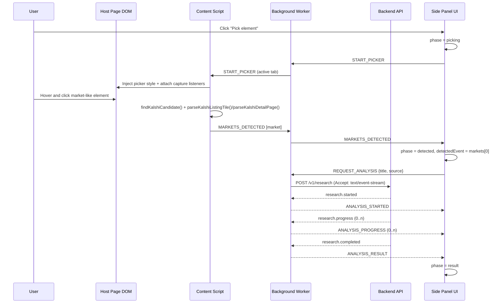
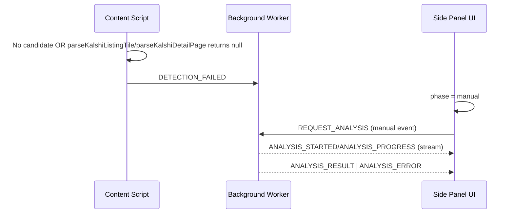
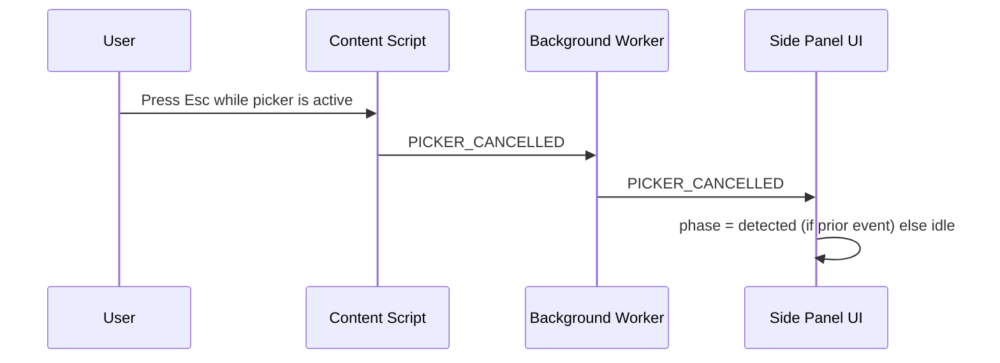
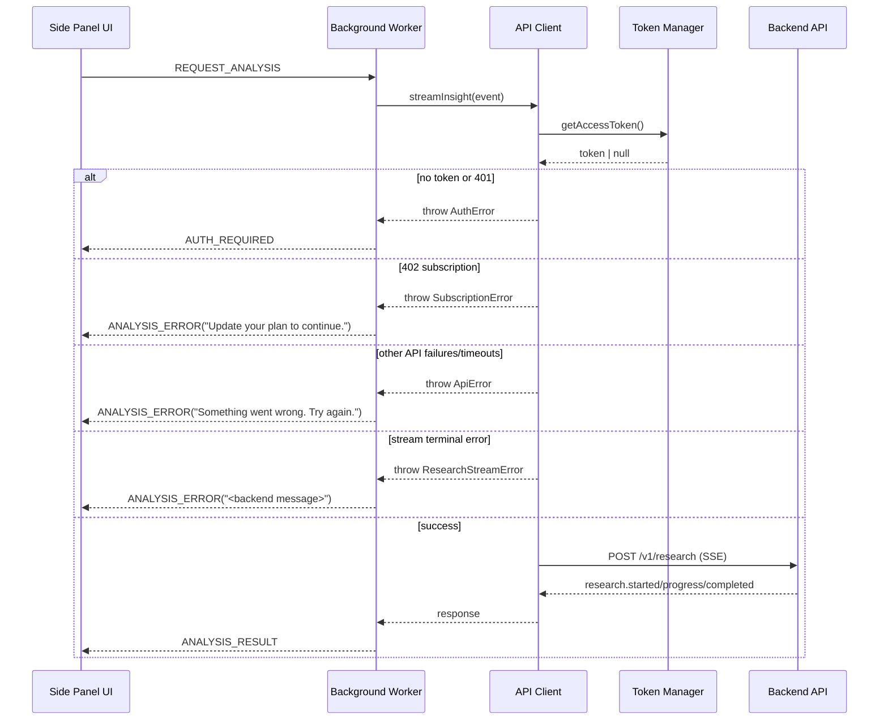
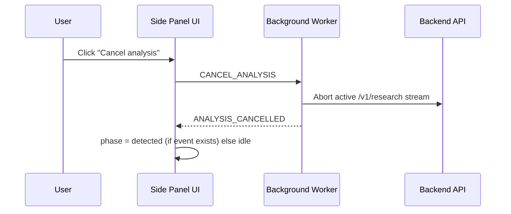
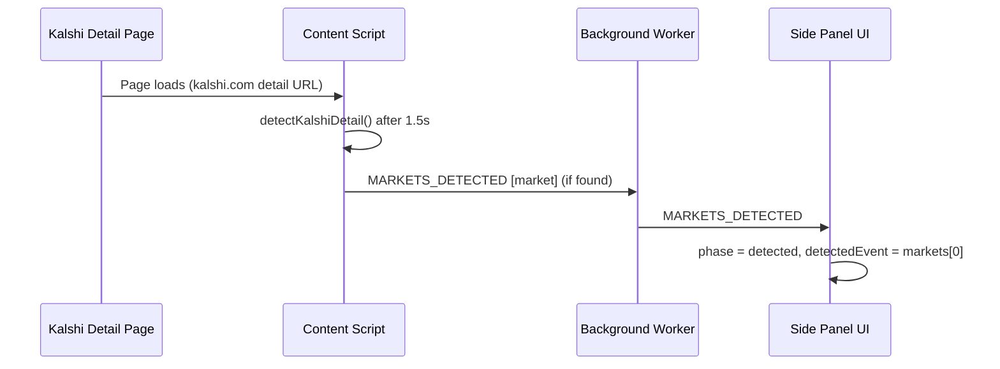

# Data Flow

## Happy Path: Picker Selection to Result

## Picker Failure Fallback: Manual Input Path

## Picker Cancel Path

## Auth and Error Mapping Path

## Stream Cancel Path

## Kalshi Auto-Detect Path

## Checks and Guards in Flow

- Event text is sanitized before request (`<...>` tags stripped, trimmed, max 500 chars).
- Picker click interception uses capture phase and prevents default page click action while active.
- Candidate lookup uses site-specific finders (`findKalshiCandidate`) with generic scoring fallback.
- `parseKalshiListingTile()` / `parseKalshiDetailPage()` require a valid title and at least one parsed outcome before emitting `MARKETS_DETECTED`.
- JWT expiry is checked before each authed request; refresh is attempted if near expiry (`< 60s`).
- Stream request timeout is enforced (`AbortSignal.timeout(45_000)` when no external signal is provided).
- User-driven cancellation is supported via `CANCEL_ANALYSIS` + `AbortController`.
- UI receives normalized message types, not raw exceptions.
