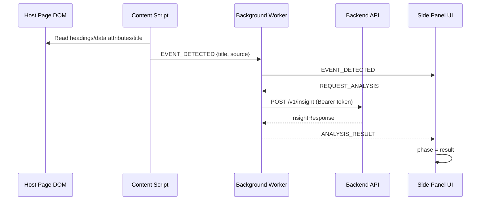
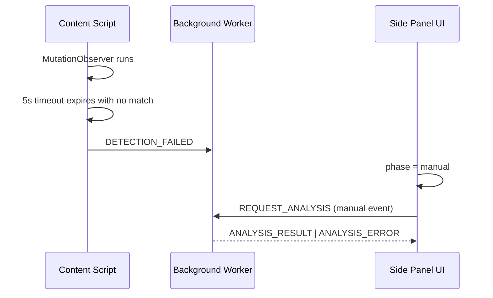
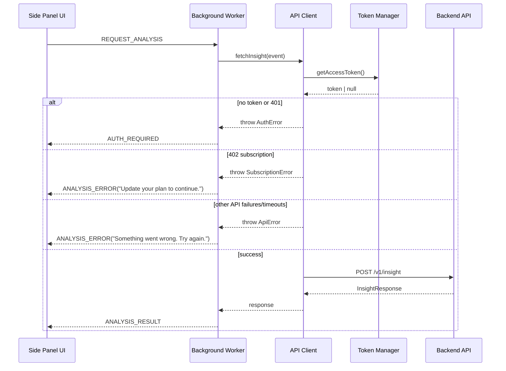

# Data Flow

## Happy Path: Auto-Detection to Result

## Detection Fallback: Manual Input Path

## Auth and Error Mapping Path

## Checks and Guards in Flow

- Event text is sanitized before request (`<...>` tags stripped, trimmed, max 500 chars).
- JWT expiry is checked before each authed request; refresh is attempted if near expiry (`< 60s`).
- Request timeout is enforced (`AbortSignal.timeout(12_000)`).
- UI receives normalized message types, not raw exceptions.
