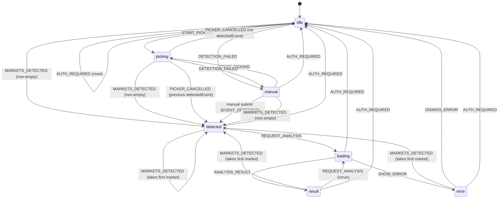

# Side Panel State Machine

Reducer and state live in `src/sidepanel/App.tsx` and use contracts from `src/shared/types.ts`.

## Phase Definitions

- `idle`: waiting for detection or user action.
- `picking`: waiting for user selection on the host page.
- `detected`: an event exists and can be analyzed.
- `manual`: no event detected; manual entry is shown.
- `loading`: analysis request in-flight.
- `result`: analysis data rendered.
- `error`: failure state with dismiss action.

## Transition Diagram

## Action Effects

- `MARKETS_DETECTED`: if payload is empty, switch to `manual`; otherwise map `payload[0]` into `detectedEvent`, set `phase = detected`, and clear previous `result`/`error`.
- `EVENT_DETECTED`: stores `detectedEvent`, clears prior error.
- `DETECTION_FAILED`: switches UI to manual input phase.
- `START_PICKING`: sets `phase = picking`.
- `PICKER_CANCELLED`: returns to `detected` when a previous `detectedEvent` exists, otherwise `idle`.
- `REQUEST_ANALYSIS`: enters loading and clears error.
- `ANALYSIS_RESULT`: stores response payload and enters result phase.
- `SHOW_ERROR`: stores message and enters error phase.
- `DISMISS_ERROR`: clears error and returns to idle.
- `AUTH_REQUIRED`: resets full app state to initial unauthenticated state.
- `SET_USER`: updates user auth/plan metadata.
